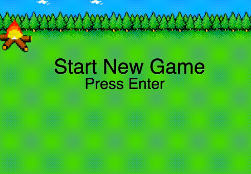

# Fire Chief Squirtle

[Play it Here](https://sloq.github.io/Fire_Chief_Squirtle/)

Fire Chief Squirtle is a JavaScript game inspired by The Legend of Zelda.



## Gameplay

| Action     | Key Input      |
|:----------:|:--------------:|
| Move Left  | 'A'            |
| Move Right | 'D'            |
| Move Up    | 'W'            |
| Move Down  | 'S'            |
| Shoot Water| Spacebar       |
| Restart    | Enter          |

## Technologies Used
Fire Chief Squirtle was build with the following technologies
* Vanilla JavaScript for game mechanics
* CSS3 for page layout
* HTML Canvas for rendering of the game
* Webpack to bundle and serve the multiple scripts used


## Technical details

All object that can interact onscreen are classes that inherit from the MovingObjects class. Objects with a finite lifespan further inherit from the TemporaryObject class. In this way adding new enemies, attacks, or bonus items will be easy updates in the future.

In order to throttle how often Squirtle was able to spray water in the constructor I set a spaceDown variable to the current time

```javascript
this.spaceDown = Date.now();
```
Then in the update function I checked the time since the previous space press against the current time to see if enough time had elapsed for a second press

```javascript
let time = Date.now();
if  (this.keyboarder.isDown(this.keyboarder.KEYS.SPACE) && (time-this.spaceDown > 500)) {
  this.spaceDown = time;
  let splashPositionX = this.x + 3;
  let splashPositionY = this.y;
```

## Future Features

* New enemy classes that employ different/more complex logic
* Add sound effects and background music
* Have extinguished enemies drop gems that can power up Squirtle until it evolves and upgrades his water splash
