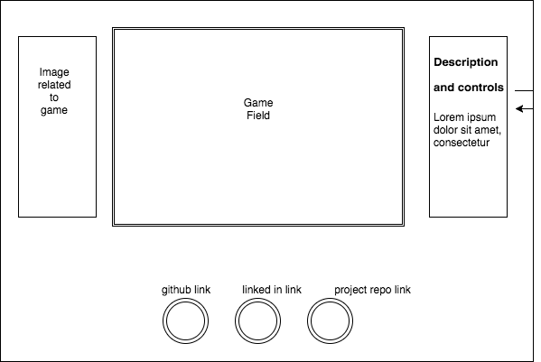

## Zelda Style console action game

### Background

Zelda is a classic Nintendo game. In the game the primary mechanics are that the player is viewed from a top down prospective. Moving along the x and y axis the player avoids enemies and attacks enemies. If the player runs into an enemy they receive damage unless they are attacking in the same direction as the approaching enemy.

The gameplay mechanics can build further on the basic moving and forward attacking.  This game will incorporate several of those variations, outlined in the **Functionality & MVP** and **Bonus Features** sections.  

### Functionality & MVP  

In this game, Fire Chief Squirtle players will be able to:

- [ ] Navigate the map
- [ ] Attack enemies
- [ ] Take damage from enemies/be killed by enemies
- [ ] Win by extinguishing all the enemies

In addition, this project will include:

- [ ] A sidebar describing the controls
- [ ] A production Readme
- [ ] Scripts for the game, Squirtle(who the player controls), detecting keypresses, and enemies.

### Wireframes

This app will all be on a single screen. The game, controls, links to my Github, LinkedIn, an the project repo.

Navigation will be done through the arrow keys and attacking will be done with the spacebar. If a player dies they will have the option to start a new game.

### Architecture and Technologies

This project will be implemented with the following technologies:

- Vanilla JavaScript for overall structure and game logic,
- `HTML5 Canvas` for DOM manipulation and rendering,
- Webpack to bundle and serve up the various scripts.

### Implementation Timeline

**Day 1**: Setup all necessary Node modules, including getting webpack up and running.  Create `webpack.config.js` as well as `package.json`.  Write a basic entry file and the bare bones of all 3 scripts outlined above. Goals for the day:

- have a background image and functioning sprites

**Day 2**: Create enemies. Build the logic for enemy player collision. Player can also attack and kill enemy. Goals for the day:

- functioning enemy components that move around the map.
- player dies/game over if enemy hits the player
- enemy dies if player lands a hit.

**Day 3**: When multiple enemies are onscreen the vanquished enemies can attempt to respawn while other enemies are still alive on the map. Add background music. Goals for the day:

- Player can kill enemies.
- Background music.
- Enemies have logic to return to respawn location after being killed.

**Day 4**: Implement different enemies. Add a life bar or multiple levels.  Goals for the day:

- Implement more logic for how new enemy interacts with user.
- create level transitions and a life count for users.

### Bonus features

Some anticipated updates are:

- [ ] Add the ability for a users avatar to evolve.
- [ ] evolution would happen after collecting a given amount of dropped gems that enemies will drop.
- [ ] create more complex logic for enemy interaction.
